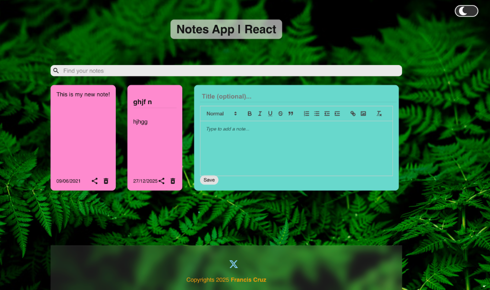
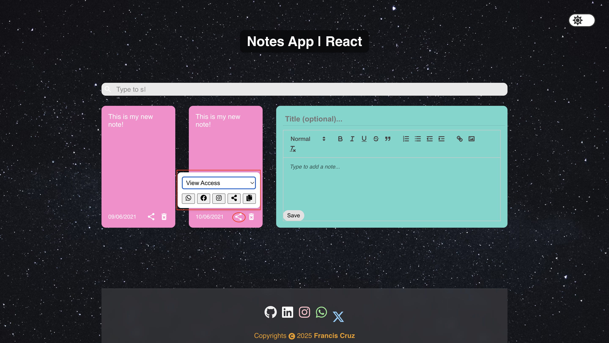

# Notes App | React

A modern, feature-rich Notes Application built with React.js.

## 🌐 Live Demo

🔗 **Live Site:** 
[https://notesapp-react.netlify.app](https://notesapp-react.netlify.app)

## ✨ Features

- **Rich Text Editor**: Write notes with **Bold**, *Italic*, <u>Underline</u>, Lists, Links, and Images.
- **Privacy First**: All notes are stored locally in your browser (LocalStorage).
- **Secure Sharing**: Share notes via **View** or **Edit** access links.
- **Social Integration**: One-click sharing to WhatsApp, Facebook, Instagram, and Twitter (X).
- **Theming**: Beautiful Dark and Light modes with premium backgrounds.
- **Responsive**: Fully optimized for Desktop, Tablet, and Mobile.
- **Search**: Real-time search by Title or Content.

## 📸 Screenshots

### Main Interface (Dark Mode)


### Share Options & Access Control


## 🛠️ Tech Stack

- **Frontend**: React.js
- **Styling**: Styled Components, Semantic UI, CSS3
- **Editor**: React-Quill
- **Icons**: React-Icons (SVG)
- **Deployment**: Netlify

## 📦 Installation

1. Clone the repository:
   ```bash
   git clone https://github.com/ajf013/notes-app-react-main.git
   ```
2. Install dependencies:
   ```bash
   npm install
   ```
3. Run the app:
   ```bash
   npm start
   ```

## 🤝 Contributing

Contributions are welcome! Please feel free to submit a Pull Request.

## 📄 License

This project is licensed under the MIT License.

## You can reach out 😊😊
Feel free to contact me about the problems. I will try to help as much as I can 😉

[](https://www.linkedin.com/in/ajf013-francis-cruz/)
[](mailto:cruzmma2021@gmail.com)
[](https://github.com/ajf013)
